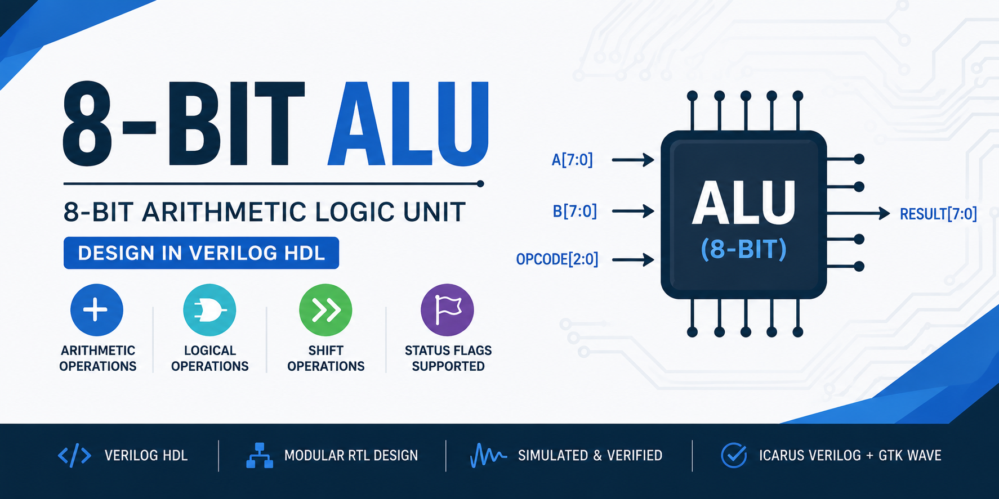
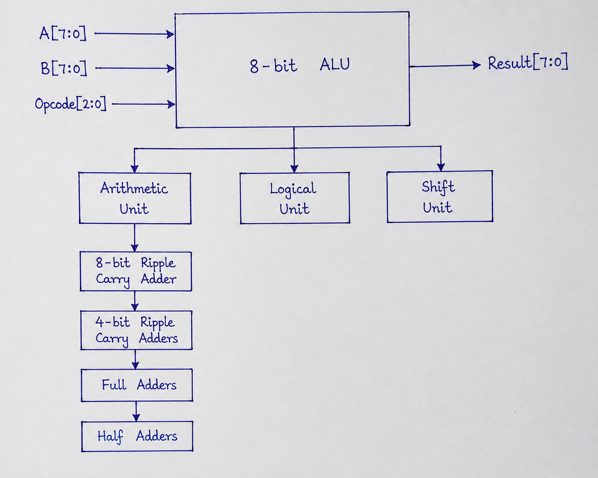
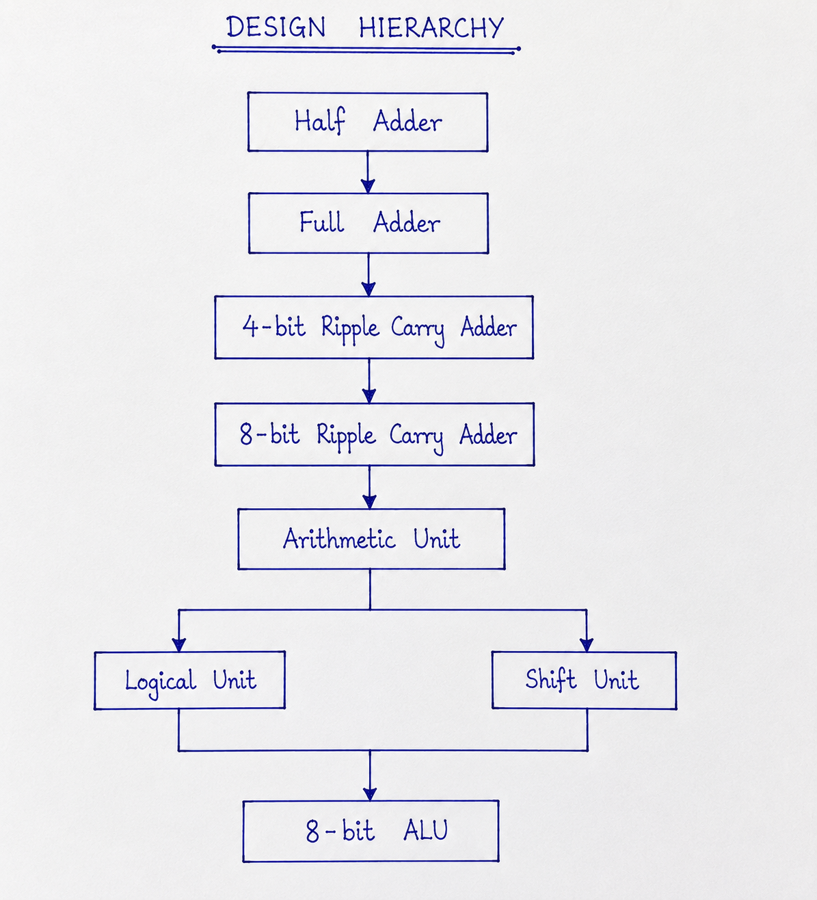
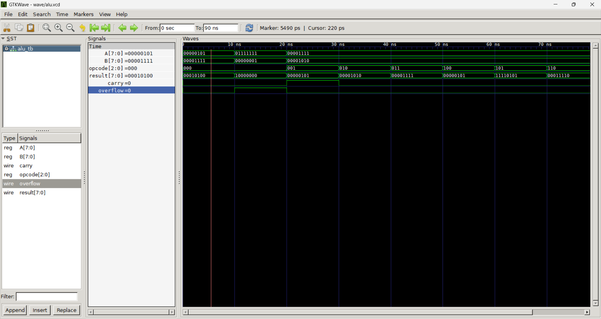
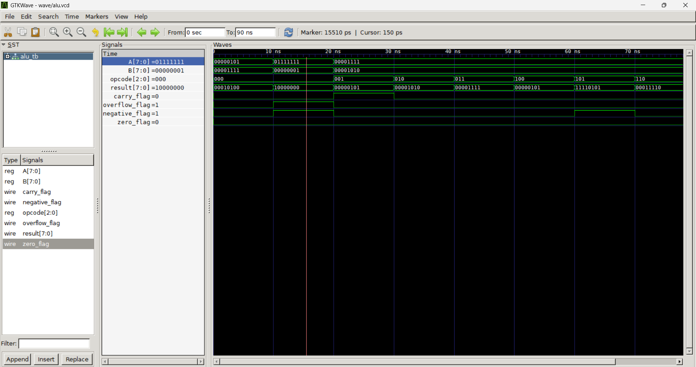

<p align="center">
  
</p>

<h1 align="center">8-bit ALU Design in Verilog</h1>

<p align="center">
RTL Design • Verilog HDL • Digital Design • FPGA • Icarus Verilog • GTKWave
</p>

---

## Project Overview

An RTL implementation of an **8-bit Arithmetic Logic Unit (ALU)** designed entirely in **Verilog HDL**.

This project follows a **bottom-up hardware design approach**, beginning with basic combinational logic (Half Adder) and progressively integrating reusable modules into a complete **8-bit ALU**. Every module is designed, simulated, and verified independently before being integrated into the final design.

---

## Features

### Arithmetic Operations

- 8-bit Addition
- 8-bit Subtraction

### Logical Operations

- AND
- OR
- XOR
- NAND

### Shift Operations

- Logical Left Shift
- Logical Right Shift

### Status Flags

- Carry Flag
- Overflow Flag
- Zero Flag
- Negative Flag

---

## Opcode Table

| Opcode | Operation |
|:------:|-----------|
| `000` | Addition |
| `001` | Subtraction |
| `010` | AND |
| `011` | OR |
| `100` | XOR |
| `101` | NAND |
| `110` | Logical Left Shift |
| `111` | Logical Right Shift |

---

## ALU Architecture

<p align="center">
    
</p>

---

## Design Hierarchy

<p align="center">
    
</p>

---

## 📈 Development Process

<p align="center">
    
</p>

---

## Project Structure

```text
8bit_ALU
│
├── Images/
│   ├── Project_banner.png
│   ├── ALU_Architecture.png
│   ├── Design_Hierarchy.png
│   ├── Development_Process.png
│   ├── ALU_TB_output.png
│   └── ALU_with_flags_TB_output.png
│
├── rtl/
│   ├── half_adder.v
│   ├── full_adder.v
│   ├── ripple_adder_4bit.v
│   ├── ripple_adder_8bit.v
│   ├── arithmetic_unit.v
│   ├── logical_unit.v
│   ├── shift_unit.v
│   └── alu.v
│
├── tb/
│   ├── Half_adder_TB.v
│   ├── full_adder_TB.v
│   ├── ripple_adder_4bit_TB.v
│   ├── ripple_adder_8bit_TB.v
│   ├── arithmetic_unit_TB.v
│   ├── logical_unit_TB.v
│   ├── shift_unit_TB.v
│   └── alu_TB.v
│
├── sim/
│
├── wave/
│
├── LICENSE
└── README.md
```

---

## ALU Interface

### Inputs

```verilog
input [7:0] A;
input [7:0] B;
input [2:0] opcode;
```

### Outputs

```verilog
output [7:0] result;

output carry_flag;
output overflow_flag;
output zero_flag;
output negative_flag;
```

---

## Module Verification Status

| Module | RTL | Testbench | Simulation | GTKWave | Status |
|:------------------------|:---:|:---------:|:----------:|:--------:|:---------:|
| Half Adder | ✅ | ✅ | ✅ | ✅ | VERIFIED |
| Full Adder | ✅ | ✅ | ✅ | ✅ | VERIFIED |
| 4-bit Ripple Carry Adder | ✅ | ✅ | ✅ | ✅ | VERIFIED |
| 8-bit Ripple Carry Adder | ✅ | ✅ | ✅ | ✅ | VERIFIED |
| Arithmetic Unit | ✅ | ✅ | ✅ | ✅ | VERIFIED |
| Logical Unit | ✅ | ✅ | ✅ | ✅ | VERIFIED |
| Shift Unit | ✅ | ✅ | ✅ | ✅ | VERIFIED |
| Top ALU | ✅ | ✅ | ✅ | ✅ | VERIFIED |

---

## Simulation

### Compile

```bash
iverilog -o sim/alu.out rtl/*.v tb/*.v
```

### Run

```bash
vvp sim/alu.out
```

### Open GTKWave

```bash
gtkwave wave/alu.vcd
```

---

## Simulation Results

The ALU has been successfully verified using custom Verilog testbenches.

### Operations Verified

- Addition
- Subtraction
- AND
- OR
- XOR
- NAND
- Logical Left Shift
- Logical Right Shift

### Flags Verified

- Carry Flag
- Overflow Flag
- Zero Flag
- Negative Flag

Waveforms were analyzed using **GTKWave**.

---

### ALU Testbench Output

<p align="center">
    
</p>

---

### ALU with Flags

<p align="center">
    
</p>

---

## Tools Used

- Verilog HDL
- Icarus Verilog
- GTKWave
- Visual Studio Code
- Git
- GitHub

---

## Future Improvements

### Phase 2

- 4-bit Opcode ALU
- Multiplication
- Division
- Increment
- Decrement
- Compare
- Rotate Left
- Rotate Right

### Phase 3

- Parameterized ALU
- Carry Lookahead Adder (CLA)
- Barrel Shifter
- Signed Arithmetic
- Randomized Testbench
- Functional Coverage
- SystemVerilog Assertions (SVA)

---
<p align="center">
If you found this project useful, consider giving it a ⭐ on GitHub.
</p>